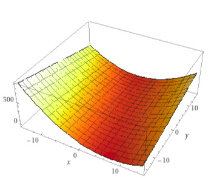

# Trabalho da matéria de OC
Feito junto com meus colegas:
- Matheus Gaspar
- Lucas Batista D. Duarte
### Objetivo:
Desenvolver um código de Algoritmo Genético, aonde o usuário começara inserindo qual será o tamanho da população inicial, em seguida quantas gerações deverá ter, após isso será plotado dois gráficos para serem visualizados, um que mostrara o fitness médio de cada população, e outro que mostrara o fitnes de cada individuo em cada população.
## Aqui serão feitas algumas anotaçãoes sobre o trabalho da matéria de Otimização Combinatória

### Parâmetros passados pelo professor:

| Codificação | Seleção | Cruzamento | Mutação          | Elitismo                   | Função de otimização |
| ------------- | --------- | ---------- | ------------------ | -------------------------- | ------------------------ |
| Binária      | Ranking   | Uniforme   | Inversão Binária | 1 Indivíduo por geração | Função 10              |

### Função 10:

Função de Otimização: Z = 2x³ - 13x + xy - 7 y/3

Restrições: x ∈ [-15, 15] E y ∈ [-15, 15]

